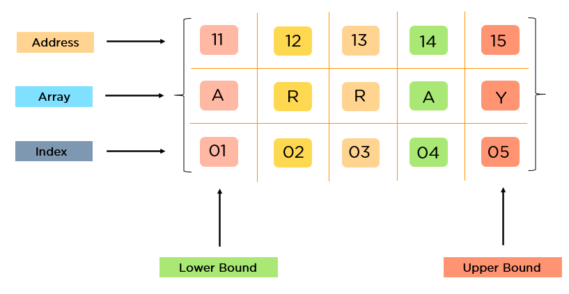
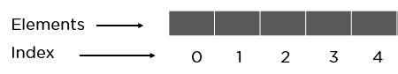
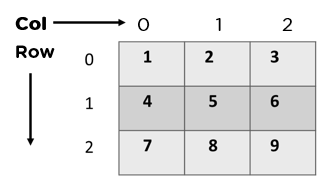
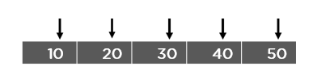

### Array in Data Structures
- An array is a linear data structure that collects elements of the same data type and stores them in contiguous and adjacent memory locations. 
- Arrays work on an index system starting from 0 to (n-1), where n is the size of the array.

  

  

 

#### What Are the Types of Arrays?

There are majorly two types of arrays, they are:
- One-Dimensional Arrays
- Multi-dimensional Arrays

 

#### One-Dimensional Arrays
You can imagine a 1d array as a row, where elements are stored one after another.

  

 

 

#### Multi-Dimensional Arrays:
These multi-dimensional arrays are again of two types. They are:

  

  

#### What Operations Can You Perform on an Array?
- Traversal
- Insertion
- Deletion
- Searching
- Sorting

#### Traverse an array
To traverse an array means to access each element (item) stored in the array so that the data can be checked or used as part of a process

  

  

