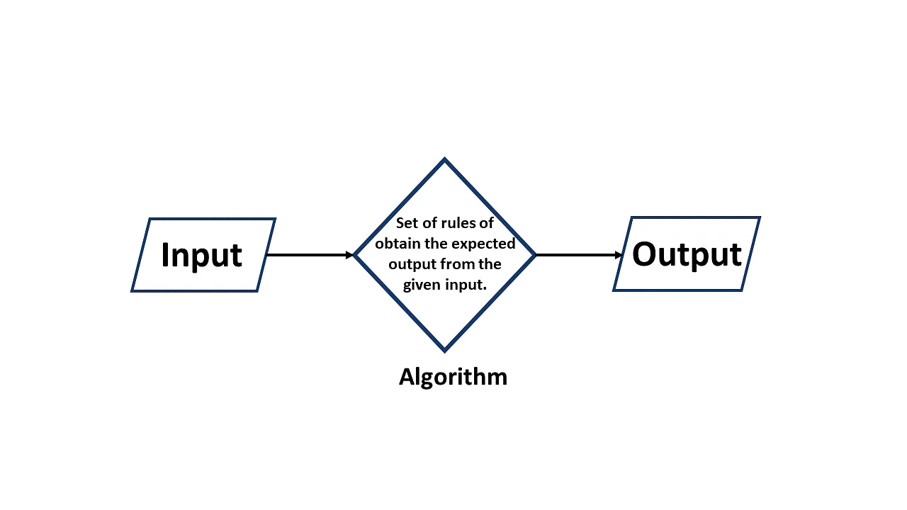

## What is an Algorithm?

In computer programming terms, an algorithm is a set of well-defined instructions to solve a particular problem. It takes a set of input(s) and produces the desired output.

In other words, An algorithm is a set of commands that must be followed for a computer to perform calculations or other problem-solving operations.

##### For Example 
- Sum of two integer numbers

#### An algorithm to have sum of two numbers:

- Take two integer numbers as inputs 
- Add numbers using the + operator 
- Display the result as output

<p align="left">
  
</p> 


#### A Good Algorithm consists of 
- Input and output is defined precisely.
- Each step in the algorithm has a clear purpose, and unambiguous.
- Approach should be most effective among different ways to solve a problem.

#### A Definition
- **Problem**: A problem can be defined as a real-world problem or real-world instance problem for which you need to develop a program or set of instructions. An algorithm is a set of instructions.
- **Algorithm**: An algorithm is defined as a step-by-step process that will be designed for a problem.
- **Input**: After designing an algorithm, the algorithm is given the necessary and desired inputs.
- **Processing** unit: The input will be passed to the processing unit, producing the desired output.
- **Output**: The outcome or result of the program is referred to as the output.

#### Different Types of Algorithms 
There are several types of algorithms, all designed to accomplish different tasks. For example, algorithms perform the following:
- **Brute-force algorithm**.
    - This algorithm iterates all possible solutions to a problem blindly, searching for one or more solutions to a function.
- **Sorting algorithm**.
    - Sorting algorithms are used to rearrange data structure based on a comparison operator, which is used to decide a new order for data.
- **Recursive algorithm**. 
  - This algorithm calls itself repeatedly until it solves a problem. Recursive algorithms call themselves with a smaller value every time a recursive function is invoked.
- **Backtracking algorithm**. 
  - This algorithm finds a solution to a given problem in incremental approaches and solves it one piece at a time.
- **Divide-and-conquer algorithm**. 
  - This common algorithm is divided into two parts. One part divides a problem into smaller subproblems. The second part solves these problems and then combines them together to produce a solution.
- **Dynamic programming algorithm**. 
  - This algorithm solves problems by dividing them into subproblems. The results are then stored to be applied for future corresponding problems.
- **Greedy algorithm**.
    - This algorithm solves optimization problems by finding the locally optimal solution, hoping it is the optimal solution at the global level. However, it does not guarantee the most optimal solution.
- **Hashing algorithm**. 
  - This algorithm takes data and converts it into a uniform message with a hashing
- **Randomized algorithm**. 
  - This algorithm reduces running times and time-based complexities. It uses random elements as part of its logic.


#### The Complexity of an Algorithm
The algorithm's performance can be measured in two ways:
- Time Complexity
- Space Complexity

#### Time Complexity
- The amount of time required to complete an algorithm's execution is called time complexity.
- The big O notation is used to represent an algorithm's time complexity.
- The time complexity is calculated primarily by counting the number of steps required to complete the execution. Let us look at an example of time complexity.

``` text
    // Suppose you have to calculate the multiplication of n numbers.
    mult = 1;
    for i=1 to n
    mul = mul *1
    // when the loop ends, then mul holds the multiplication of the n numbers
    return mul;
   
```
Time Complexity of above code : O(n)

#### Space Complexity
The amount of space an algorithm requires to solve a problem and produce an output is called its space complexity. Space complexity, like time complexity, is expressed in big O notation.

The space is required for an algorithm for the following reasons:

- To store program instructions.
- To store track of constant values.
- To store track of variable values.
- To store track of function calls, jumping statements, and so on.


**Space Complexity = Auxiliary Space + Input Size**


#### Examples
- Add two numbers entered by the user
```text
    Add two numbers entered by the user
     Step 1: Start
     Step 2: Declare variables num1, num2 and sum.
     Step 3: Read values num1 and num2.
     Step 4: Add num1 and num2 and assign the result to sum.
     sum←num1+num2
     Step 5: Display sum
     Step 6: Stop
```
- Find the largest number among three numbers
```text
Step 1: Start
Step 2: Declare variables a,b and c.
Step 3: Read variables a,b and c.
Step 4: If a > b
           If a > c
              Display a is the largest number.
           Else
              Display c is the largest number.
        Else
           If b > c
              Display b is the largest number.
           Else
              Display c is the greatest number.  
Step 5: Stop
```
- Check whether a number is prime or not
```text
Step 1: Start
Step 2: Declare variables n, i, flag.
Step 3: Initialize variables
        flag ← 1
        i ← 2  
Step 4: Read n from the user.
Step 5: Repeat the steps until i=(n/2)
     5.1 If remainder of n÷i equals 0
            flag ← 0
            Go to step 6
     5.2 i ← i+1
Step 6: If flag = 0
           Display n is not prime
        else
           Display n is prime
Step 7: Stop 
```
