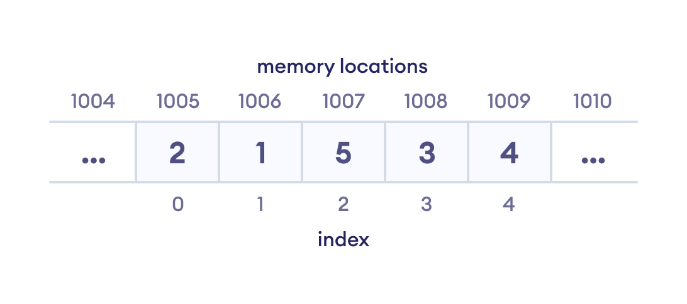
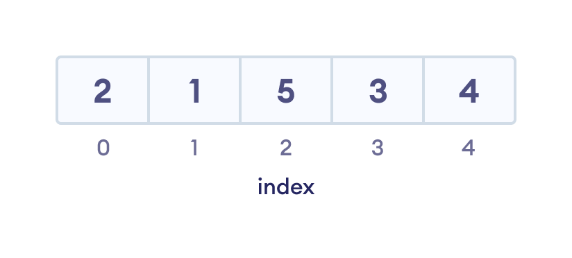
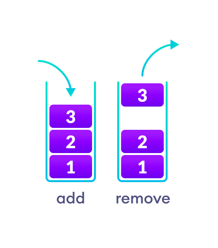
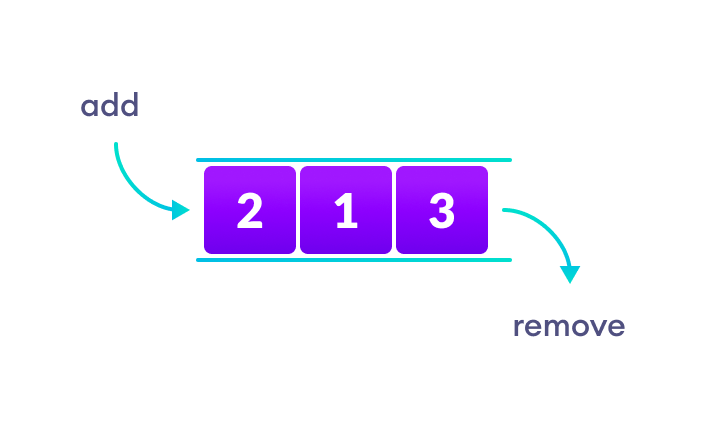
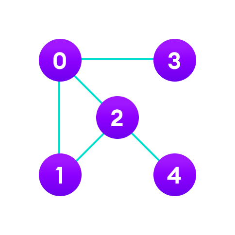
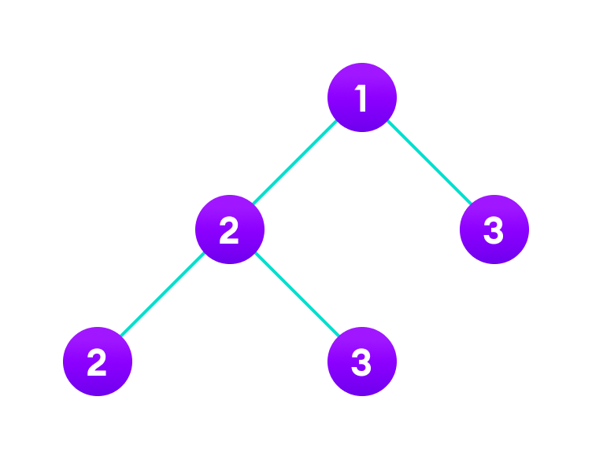

### What are Data Structures?

Data structure is a storage that is used to store and organize data. It is a way of arranging data on a computer so that it can be accessed and updated efficiently.

**Data structure helps you to write memory and time efficient code.**

For example, if you want to store data sequentially in the memory, then you can go for the Array data structure.

  

 

### Types of Data Structure
Basically, data structures are divided into two categories:

- Linear data structure
- Non-linear data structure

Let's learn about each type in detail.

### Linear data structures
In linear data structures, the elements are arranged in sequence one after the other. Since elements are arranged in particular order, they are easy to implement.

However, when the complexity of the program increases, the linear data structures might not be the best choice because of operational complexities.

#### Array Data Structure
- In an array, elements in memory are arranged in continuous memory. 
- All the elements of an array are of the same type. 
- And, the type of elements that can be stored in the form of arrays is determined by the programming language.
 

  

 

#### Stack Data Structure
In stack data structure, elements are stored in the LIFO (Last In First Out) principle. That is, the last element stored in a stack will be removed first.

It works just like a pile of plates where the last plate kept on the pile will be removed first. 

  

 

#### Queue Data Structure
Unlike stack, the queue data structure works in the FIFO (First In First Out) principle where first element stored in the queue will be removed first.

It works just like a queue of people in the ticket counter where first person on the queue will get the ticket first.

  

 

#### LinkedList Data Structure
In linked list data structure, data elements are connected through a series of nodes. And, each node contains the data items and address to the next node.

  

 

### Non linear data structures
Unlike linear data structures, elements in non-linear data structures are not in any sequence. Instead they are arranged in a hierarchical manner where one element will be connected to one or more elements.

Non-linear data structures are further divided into graph and tree based data structures.

#### Graph Data Structure
In graph data structure, each node is called vertex and each vertex is connected to other vertices through edges.

  

  

#### Popular Graph Based Data Structures:

- Spanning Tree and Minimum Spanning Tree
- Strongly Connected Components
- Adjacency Matrix
- Adjacency List

#### Tree Data Structure
Similar to a graph, a tree is also a collection of vertices and edges. However, in tree data structure, there can only be one edge between two vertices.

  

  

#### Popular Tree based Data Structure

- Binary Tree
- Binary Search Tree
- AVL Tree
- B-Tree
- B+ Tree
- Red-Black Tree

